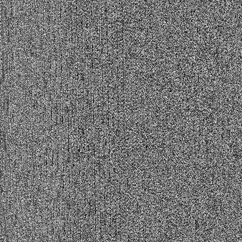
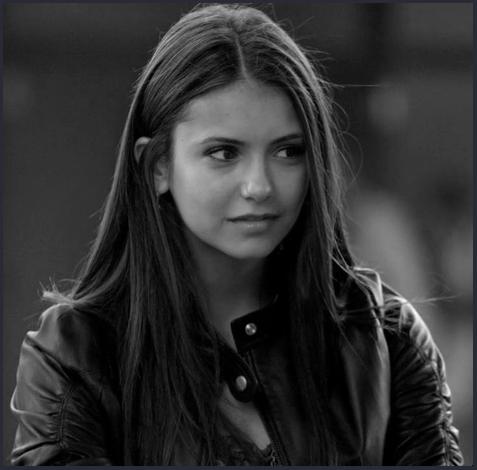

# RSA
RSA es un sistema criptográfico de clave pública desarrollado en 1979. Es el primer y más utilizado algoritmo de este tipo y es válido tanto para cifrar como para firmar digitalmente. La seguridad de este algoritmo radica en el problema de la factorización de números enteros.\
En este proyecto se implemetó el algoritmo RSA para imagenes, se cifra y muestra la imagen cifrada y podemos decifrar esta para obtener la original.

## Librerias usadas
Se usó dos librerias principales:
- [NTL/ZZ](https://www.shoup.net/ntl) la cual es una libreria para el manejo de numeros gigantes que C++ no maneja por defecto. Para su instalacion debemos seguir su [guia](https://www.shoup.net/ntl/doc/tour-unix.html).
- [Cimg](http://cimg.eu/) es una libreria para la manipulacion sencillo y portable de imagenes en C++, en este repositorio ya se incluye por lo que su descarga no es necesaria pero aqui le dejamos el [link de descarga](http://cimg.eu/download.shtml).

## Compilacion en Linux
Dentro de la carpeta de este reposiutorio ejecutar:
```bash
g++ -o capt probando.cpp -O2 -L/usr/X11R6/lib -lm -lpthread -lX11 -std=c++11 -pthread -march=native -lntl -lgmp
```

## Screenshots
### Antes de cifrar

### Imagen cifrada

### Imagen descifrada


## Uso de Git y GitHub
Para la creacion de repositorio local, iniciamos git de forma local, esto porque tenemos un proyecto ya hecho
```bash
git init
```
Agregamos los archivos, podemos poner git add . para no agregar uno por uno
```bash
git add main.cpp
```
Hacemos commit de los archivos que agregamos
```bash
git commit -m "Main del proyecto"
```
Nos metemos a la rama principal
```bash
git branch -M master
```
Conectamos con el repositorio en GitHub
```bash
 git remote add origin https://github.com/oscarnar/RSA_image.git
```
Subimos todos los cambios hacia el repo en GitHub
```bash
git push -u origin master
```
